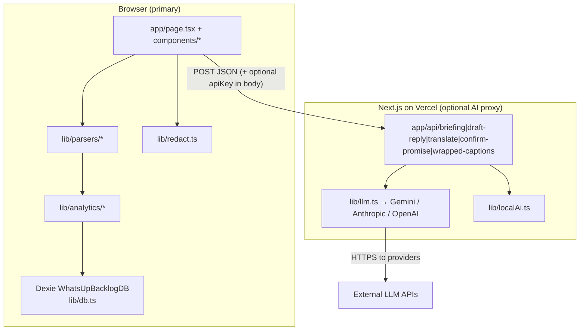

# WhatsUP? — Comprehensive Read-Only System Audit

**Audit date:** October 9, 2026  
**Scope:** Repository `WhatsUp-` and public homepage [https://whats-up-mu.vercel.app/](https://whats-up-mu.vercel.app/)  
**Mode:** Analysis-only inspection (this document is the deliverable; fixes are recommendations only).

**Note on stated stack:** Some briefs mention React + Vite + Express. The **actual** implementation is **Next.js 14 (App Router)**, **React 18**, **TypeScript**, **Dexie/IndexedDB**, and **Next.js Route Handlers** under `app/api/*` — not Vite or Express.

**Limitations (important):** During this audit, `node_modules` was not available in the inspection environment, so **`npm test`, `npm run build`, `npx tsc --noEmit`, and `npm audit` were not executed**. Live verification was limited to fetching the production homepage (shell loads; engine shows “Local AI”, “100% Local (0 bytes sent)”). No authenticated production env, no load tests, no full browser E2E.

---

## A. Executive Summary

**Overall health:** Strong hackathon-grade product: clear problem focus, thoughtful local-first analytics (ghost radar, promise ledger, reply debt), solid parser/analytics test fixtures, and polished dashboard UX. Architecture matches the “guilt ledger” narrative.

**Strongest aspects:**

- End-to-end **client-side parsing and analytics** (`lib/parsers/*`, `lib/analytics/*`, Dexie schema in `lib/db.ts`).
- **Export-relative time** for ghosts/promises when analyzing imports (`analyzeChat` / `classifyGhostStatus` use last message or explicit `referenceTime`).
- **PII redaction pipeline** for most AI flows (`lib/redact.ts`, preview modal in briefing/draft flows).
- **Zip safety basics** (path traversal, file count cap) in `lib/parsers/zip.ts`.
- **Zod-validated LLM JSON** in `lib/llm.ts`.

**Most important weaknesses:**

1. **Documentation and UI claims exceed implementation** for BYOK encryption, Supabase auth, AES-GCM tests, and some README features.
2. **Server AI routes are open proxies** (no auth, no rate limits) — risky if `GEMINI_API_KEY` (or similar) is set on Vercel.
3. **Privacy gaps:** per-message translate sends **raw** chat text; API keys stored and sent **in plaintext** despite `lib/cryptoKey.ts` and marketing copy.
4. **Operational gaps:** no CI, workers unused (large imports block UI), all messages loaded into React state.

**Main risks before hackathon evaluation:**

- Judge asks “show me SECURITY.md” → **Supabase / AES-GCM / never sent to server** statements are **partially false**.
- Demo with cloud AI on Vercel → **quota abuse** or unexpected billing.
- Stale export + “Overdue” tab → **false overdue** (wall-clock vs export time).

---

## B. Architecture Overview

### Current system

| Layer | Responsibility |
|--------|----------------|
| **UI** | Single dashboard (`app/page.tsx`); modals for import, briefing, drafts, wrapped, amends, identity, person profile |
| **Parsers** | WhatsApp txt/zip, Telegram/Discord JSON (`lib/parsers/*`) |
| **Analytics** | Ghosts, promises, debt, heatmap, sessions, person profiles |
| **Storage** | IndexedDB tables: chats, messages, stats, ghosts, promises, briefings, translations |
| **AI** | Route handlers call `callLLMWithSchema`; on failure or missing key → **local heuristics** |

### Architectural weaknesses and recommended improvements

| Issue | Why it matters | Practical fix |
|--------|----------------|----------------|
| **Monolithic client state** (`allMessages` in `page.tsx`) | Large exports → memory and re-render cost | Paginate messages per chat; query Dexie by `chatId`; optional Web Workers (files exist but unused) |
| **Unused workers** (`workers/parse.worker.ts`, `workers/analytics.worker.ts`) | UI freezes on big files | Wire importer to workers or remove dead code from docs |
| **Server as stateless LLM proxy** | Any visitor can POST large payloads | Auth (even anonymous JWT), rate limits, max body size, require BYOK only or lock server key to authenticated users |
| **Doc/code drift** | Judge trust | Align `SECURITY.md`, `README.md`, `context.md` with code |

---

## C. Bugs and Defects

| ID | Severity | Location | Evidence | Impact | Reproduce / verify | Recommended fix |
|----|----------|----------|----------|--------|-------------------|-----------------|
| **BUG-001** | High | `app/api/confirm-promise/route.ts` | On LLM failure, returns `isPromise: true`, `confidence: 0.88` for any text (lines 40–51) | False positives when confirming promises via AI | POST `/api/confirm-promise` with `"hello"` and no server API key | Fallback should use same heuristics as `extractPromises` or return `isPromise: false` with low confidence |
| **BUG-002** | Medium | `components/PromiseLedger.tsx` | Overdue tab uses `new Date()` (lines 38–39, 141) vs `extractPromises(..., effectiveRefTime)` | Old exports show promises as overdue vs “as of export” | Import chat whose last message is months ago; open Overdue tab | Use per-chat `lastMessageAt` or stored `referenceTime` for overdue comparisons |
| **BUG-003** | Medium | `lib/analytics/ghosts.ts` `calculateSleepAwareGapMs` | Sleep window uses `current.getUTCHours()` (lines 49–54), not local time | Ghost/latency wrong for non-UTC users | Compare ghost scores for same export in IST vs UTC | Use local hours or document UTC-only behavior |
| **BUG-004** | High | `components/AISettingsModal.tsx` + `lib/cryptoKey.ts` | UI claims AES-GCM; keys saved with `localStorage.setItem("whatsup_custom_api_key", apiKey.trim())` (lines 41–42). **`encryptApiKey` is never imported** | Plaintext keys on disk; XSS steals keys | Save a key → DevTools → Application → Local Storage | Wire encrypt/decrypt on save/load; add “session only” mode as documented in SECURITY.md |
| **BUG-005** | High | `lib/cryptoKey.ts` | On encrypt failure, `return plaintext` (lines 58–60); decrypt failure returns ciphertext as-is (lines 88–90) | Silent downgrade to plaintext storage | Force crypto failure (non-secure context) and save key | Fail closed; show error; do not persist |
| **BUG-006** | Medium | `lib/db.ts` `wipeAllData` | Clears IDB/localStorage keys listed (lines 52–57) but **not** `whatsup_custom_api_key` / provider | “Wipe everything” leaves BYOK secrets | Wipe data after saving API key | Remove API key entries on wipe; mention in modal copy |
| **BUG-007** | Medium | `lib/demoLoader.ts` | `loadDemoChatsIntoDB` always `await wipeAllData()` (line 119) and always writes Dexie (194–200) | Demo button destroys user data; ignores “no persist” | Import real chat → Load Demo Dataset | Confirm dialog; respect `whatsup_no_persist`; optional in-memory demo |
| **BUG-008** | Medium | `components/ChatDetailModal.tsx` | `handleTranslateMessage` sends `msg.text` raw (lines 40–43), no redaction/preview | PII sent to LLM when user translates inline | Open chat detail → translate Hinglish message with phone/name | Reuse `redactMessages` + preview or `translateTextWithCache` with redaction |
| **BUG-009** | Low | `components/BriefingModal.tsx` | POST body omits `messages`; route fallback parses redacted lines only (`app/api/briefing/route.ts` 66–75) | Weaker local briefing when LLM fails | Briefing with local engine only | Send structured redacted messages array |
| **BUG-010** | Low | `context.md` checklist | “Dual UI themes: Cozy Storybook RPG + Classic” (line 161); `prompt.md` says RPG removed | Misleading judges reading context | Read context vs UI | Update checklist; remove “Classic Mode” from README if absent |
| **BUG-011** | Low | `tests/security.test.ts` vs `context.md` | Context claims Test 4 covers “AES-GCM encryption/decryption”; tests only cover redaction + zip | False test matrix in docs | Open both files | Fix context table or add crypto tests |
| **BUG-012** | Suspected | `components/BriefingModal.tsx` / `ReplyDraftModal.tsx` | `useEffect` calls `loadOrFetch*`; function defined after conditional `return null`; missing exhaustive deps | Stale closures / eslint violations | Toggle modal rapidly, change time budget | Hoist handlers with `useCallback`; fix hook deps |

**Confirmed vs suspected:** BUG-001–011 are **code-evidenced**. BUG-012 is **suspected** without React strict-mode E2E in the audit environment.

---

## D. Security and Privacy Findings

| ID | Severity | Finding | Evidence | Impact | Remediation |
|----|----------|---------|----------|--------|-------------|
| **SEC-001** | Critical | **BYOK keys not encrypted at rest** | `AISettingsModal.tsx` plaintext localStorage; `encryptApiKey` unused | Local malware/XSS/extension reads keys | Integrate `lib/cryptoKey.ts`; never store plaintext |
| **SEC-002** | High | **API keys sent to your Next server in JSON body** | All modals pass `apiKey` in POST (`BriefingModal.tsx` 93–101, etc.) | Contradicts “never transmitted to backend”; server/logs could capture keys | Client-side-only LLM calls **or** header-based proxy with no logging + HTTPS only + short-lived tokens |
| **SEC-003** | High | **Unauthenticated, unlimited AI routes** | No middleware/auth/rate limit in `app/api/*`; `callLLMWithSchema` uses `process.env.GEMINI_API_KEY` when no BYOK | Public abuse of Vercel-deployed server key | Rate limit (IP/fingerprint), max payload size, optional Supabase anon auth as planned in `prompt.md` |
| **SEC-004** | Medium | **Gemini API key in URL query string** | `lib/llm.ts` line 155: `...generateContent?key=${apiKey}` | Query params often logged by proxies | Use header-based auth if Gemini supports it for your integration pattern |
| **SEC-005** | Medium | **CSP allows `unsafe-eval` and `unsafe-inline`** | `next.config.mjs` lines 13–14 | Weakens XSS containment | Tighten for production; nonce/hash scripts where Next allows |
| **SEC-006** | Medium | **Translation cache stores full original text** | `lib/translationCache.ts` lines 76–86 `originalText: text` | Sensitive chat persisted in IDB for translations | Store hash-only or redacted source; encrypt at rest |
| **SEC-007** | Low | **Weak cache key hash** | 32-bit rolling hash in `hashTranslationKey` | Collision → wrong translation shown | Use SHA-256 (Web Crypto) |
| **SEC-008** | Medium | **Privacy preview bypass** | `whatsup_privacy_acknowledged` in localStorage forever (`BriefingModal.tsx` 62–67) | Later AI calls skip redaction review | Per-session or per-export acknowledgment |
| **SEC-009** | High (documentation) | **SECURITY.md claims Supabase auth** | Line 14: “Supabase is configured…” — **no `@supabase/*` in `package.json`, no auth code** | False privacy story to judges | Implement auth-only Supabase **or** remove claim |
| **SEC-010** | Low | **Device-bound “encryption” is weak** | `cryptoKey.ts` derives key from `userAgent` + screen size + **static salt** | Anyone on same machine profile can decrypt | User passphrase or random local secret in sessionStorage + encrypted blob |
| **SEC-011** | Medium | **Zip bomb: partial mitigation** | Only extracted `.txt` length checked (`zip.ts` 67–71); not total uncompressed size of all entries | Theoretical DoS via huge non-txt entries | Sum declared sizes; reject nested zips explicitly |
| **SEC-012** | Low | **Personal notes not encrypted** | `PersonalTabModal.tsx` localStorage `whatsup_notes_${profile.name}` | README says “Encrypted… scratchpad” (`README.md` ~109) | Plaintext is OK if documented; don’t claim encryption |

**Secrets:** `.env.example` documents `GEMINI_API_KEY` — ensure production secrets are only in Vercel env, never committed (`.gitignore` covers `.env`).

---

## E. Performance and Reliability

| Area | Observation | Verification | Suggestion |
|------|-------------|--------------|------------|
| **Import parsing** | Synchronous on main thread in `ChatImporter.tsx` | Import 10k+ message fixture; watch UI jank | Use existing `workers/parse.worker.ts` |
| **Memory** | `loadExistingDatabase` → `db.messages.toArray()` into React (`page.tsx` 80–86) | Large multi-chat import | Load messages per modal/chat; indexed queries |
| **Network ledger** | Updates only when `bytesUsed > 0` | Local fallback calls may show “0 bytes” while still hitting `/api/*` | Count route calls separately from provider bytes |
| **Dexie** | Compound indexes present (`[chatId+timestamp]`) | Good for per-chat reads | Use them instead of full table scans |
| **Demo dataset** | Fixed `demoReferenceTime` (`demoLoader.ts` 125) | Demo ghosts/debt stable | User imports should continue using export-relative time (already in `analyzeChat`) |
| **Production** | Not build-verified in audit environment | Run `npm run build` locally / CI | Add CI build + vitest |

No invented latency numbers — measure with Chrome Performance and Network tabs.

---

## F. Code Quality and Repository Health

| Topic | Status |
|--------|--------|
| **Structure** | Clear `lib/`, `components/`, `app/api/`, `tests/` — appropriate for app size |
| **TypeScript** | `strict: true` in `tsconfig.json` |
| **Linting** | `npm run lint` in `package.json` but **no ESLint config** found — likely incomplete setup |
| **CI/CD** | **No `.github/workflows`** |
| **Tests** | 7 suites described (54 tests) in README/context; **not run during this audit** |
| **Dead code** | Workers unused; `confirm-promise` partially redundant with local promise engine |
| **Docs drift** | Supabase, dual themes, Classic Mode, Ghost “4 lanes” naming (README vs `GhostRadar.tsx`), security test claims |
| **Dependencies** | Small, modern stack; `@vitejs/plugin-react` present though app is Next — minor clutter |
| **`.gitignore`** | Sensible; ignores chat exports and `.env` |
| **Live deploy** | Homepage loads on Vercel; full SPA behavior not exercised in audit |

---

## G. Prioritized Fix Roadmap

### 1. Critical (before judges / public demo)

| Item | Effort | Why |
|------|--------|-----|
| Fix BYOK storage (SEC-001, BUG-004, BUG-005) or **remove encryption claims** | **Medium** | Trust and real user harm if keys leak |
| Lock down AI routes (SEC-003) if `GEMINI_API_KEY` on Vercel | **Medium** | Financial/abuse risk |
| Align SECURITY.md/README with reality (SEC-009, SEC-002) | **Small** | Avoid disqualifying privacy Q&A |
| Redact translate in chat detail (BUG-008) | **Small** | Consistent privacy model |

### 2. High priority

| Item | Effort | Why |
|------|--------|-----|
| Wipe includes API keys (BUG-006) | **Small** | User expectation |
| Demo dataset destructive wipe (BUG-007) | **Small** | Data-loss during live demo |
| confirm-promise fallback (BUG-001) | **Small** | Wrong ledger entries |
| Overdue uses export time (BUG-002) | **Small** | Core metric correctness |

### 3. Important reliability / architecture

| Item | Effort | Why |
|------|--------|-----|
| Worker-based parsing (ARCH-001) | **Medium** | Demo with large exports |
| Paginate messages in UI | **Large** | Scales beyond hackathon chats |
| Optional Supabase auth-only (planned in `prompt.md`) | **Large** | Rate limit + future features |

### 4. Code quality / repo

| Item | Effort | Why |
|------|--------|-----|
| Add GitHub Action: `npm ci && npm test && npm run build` | **Small** | Proves README claims |
| ESLint + `next lint` config | **Small** | Catch hook bugs |
| Fix `context.md` test matrix & features list | **Small** | Professional polish |
| Add crypto tests or remove from matrix | **Small** | Honesty |

### 5. Optional enhancements

| Item | Effort | Why |
|------|--------|-----|
| HSTS header on Vercel | **Small** | Production hardening |
| `.ics` export for promises (mentioned in old `prompt.md`) | **Medium** | Nice judge demo |
| Stronger translation cache hashing | **Small** | Edge-case correctness |

---

## H. Verification Checklist (after implementing fixes)

### Automated

- [ ] `npm install`
- [ ] `npx vitest run` — expect 54 passing (or update README count)
- [ ] `npx tsc --noEmit`
- [ ] `npm run build && npm start`
- [ ] `npm audit` (review high/critical; fix or document accepted risk)
- [ ] Add CI and confirm green on PR

### Security / privacy

- [ ] Save BYOK key → confirm **not** plaintext in Application → Local Storage (if encryption implemented)
- [ ] Generate briefing → Network tab: confirm payload is redacted; confirm key path (client-only vs server)
- [ ] Translate from **chat detail** → confirm redaction preview + ledger increment
- [ ] Wipe data → API keys and notes cleared
- [ ] Load demo → confirm warning if existing data would be deleted
- [ ] Read `SECURITY.md` aloud against code — every bullet must be true

### Functional

- [ ] Import `tests/fixtures/hinglish_chat.txt` — promises + ghost lanes
- [ ] Import old export — ghost days **not** inflated to hundreds (export-relative)
- [ ] Identity switcher — debt/ghosts/promises recalc (`handleSwitchIdentity`)
- [ ] Amends mode — mark ghost/promise paid persists after refresh
- [ ] Local AI briefing with **no** API key — works offline after load
- [ ] Cloud AI with BYOK — Zod-valid JSON returned

### Production

- [ ] Deploy preview → CSP does not block fonts/APIs
- [ ] If server `GEMINI_API_KEY` set: unauthenticated curl to `/api/briefing` should **fail** or rate-limit
- [ ] Homepage [whats-up-mu.vercel.app](https://whats-up-mu.vercel.app/) — import demo, dashboard populates

### Documentation

- [ ] Remove Supabase / dual-theme / AES test claims unless implemented
- [ ] README tech stack matches Next.js (not Vite/Express unless you add them)

---

## Summary judgment

WhatsUP? is **demo-ready as a local-first analytics product** with credible engines and tests described in-repo. The largest gap for a **privacy-forward hackathon narrative** is the **distance between SECURITY.md/README and implementation** (encryption, Supabase, server key handling, inline translate). Addressing documentation honesty and the **API route + BYOK** issues first yields the best return before evaluation—without needing a rewrite of the core local analytics stack.

---

*Generated from read-only codebase and deployment inspection. Finding IDs (BUG-*, SEC-*) are stable for tracking fixes in issues or PRs.*
