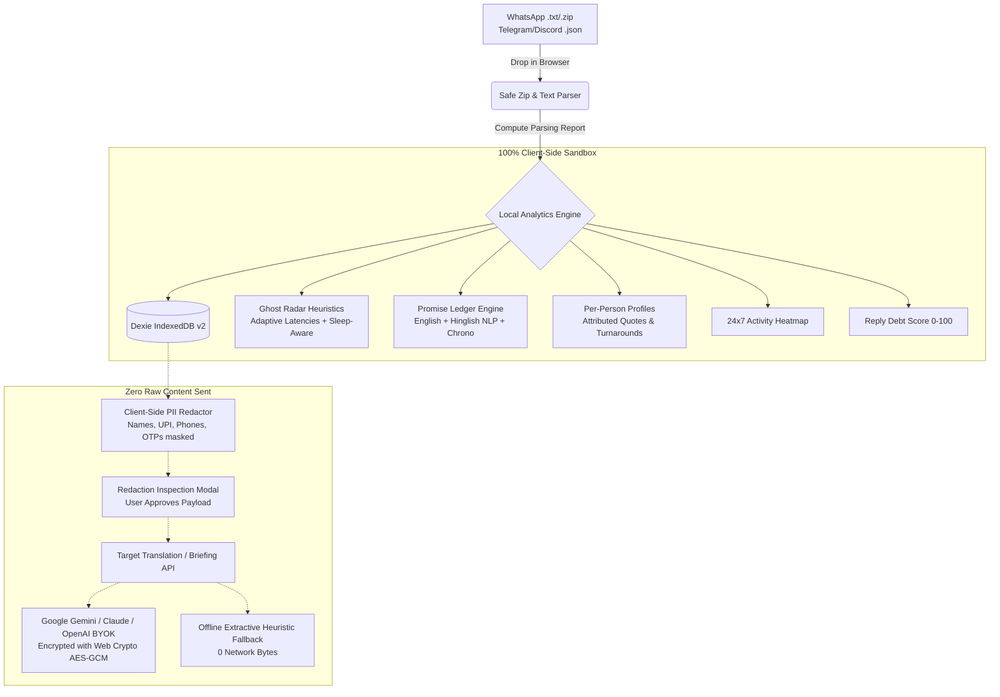
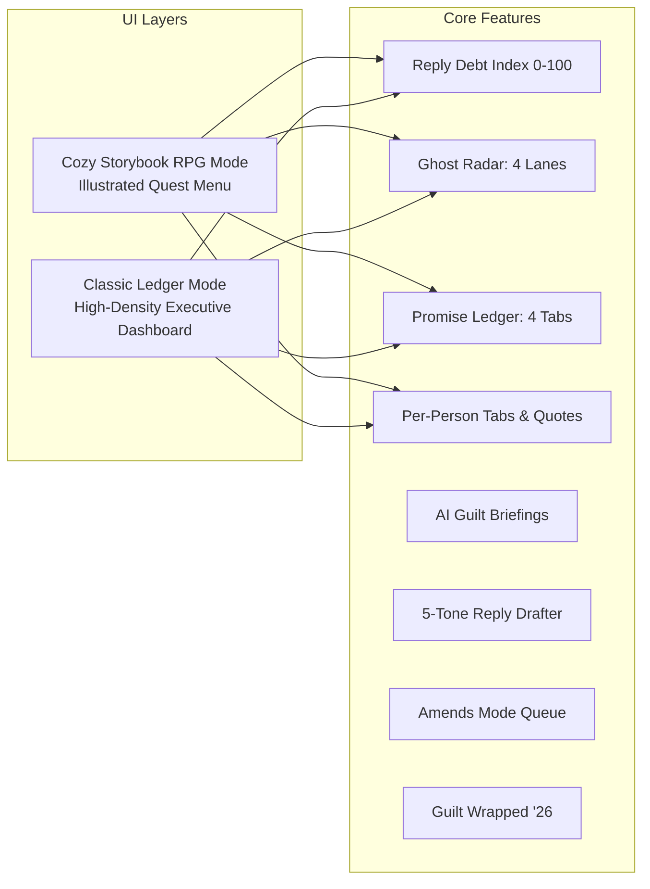

# 🚀 WhatsUP? — The Chat Guilt Ledger & Unread Command Center

> *"Other chat apps summarize your messages. We audit your social commitments and tell you who you've been leaving on read."*

[](https://nextjs.org/)
[](https://www.typescriptlang.org/)
[-green?style=for-the-badge)](https://dexie.org/)
[](./SECURITY.md)
[](https://vitest.dev/)
[](https://github.com/Nekyo7/WhatsUp-)

---

## 📌 The Problem: The Unread Debt Crisis

Every active user of WhatsApp, Telegram, or Discord faces an invisible, accumulating psychological burden: **Conversational Debt**.

* 🥀 **Unanswered direct questions:** *"Can you review the pitch deck today?"*
* 🤝 **Forgotten promises:** *"Main shaam tak bhej dunga"* (I will send it by evening)
* 👻 **Fading relationships:** Meaningful connections silently drifting into dormant silence
* 💥 **Overwhelming group chaos:** Hundreds of unread messages where you don't even know if someone asked you something

Generic AI summaries spit out dry recaps of chat banter. They don't answer the question that actually causes stress: **"Who is waiting on me, what commitments did I make, and what do I owe?"**

**WhatsUP? (The Guilt Ledger)** audits exported chat logs completely on your machine. It turns guilt into action with concrete triage queues, automated commitment resolution, and guilt-free response drafts.

---

## 🏛️ System Architecture

### 1. Zero-Knowledge Local-First Data Flow



### 2. Component Topology



---

## ✨ Feature Tour

### 1. 🗂️ Resilient Data Importer & Import Report
* Supports standard **WhatsApp `.txt` files and `.zip` archives** (Android and iOS export patterns).
* **Automatic DMY vs MDY Detection:** Pre-scans date stamps across the entire file before parsing to eliminate misparsed dates.
* **Multi-Line Continuation:** Long paragraphs, code snippets, and linebreaks remain intact with original sender attribution.
* **Interactive Import Report:** Displays message counts, detected participants, skipped system events, media placeholders, and an inspector for any unparsed lines.

### 2. 👻 Adaptive Ghost Radar (Bidirectional)
* **Two Directions:**
  * **"They ghosted me":** You reached out with a conversation turn; they haven't replied.
  * **"I ghosted them":** They sent the last turn; ball is in your court.
* **Sleep-Hour Awareness:** Automatically pauses time calculation between **23:00 and 08:00**, so a late-night message doesn't artificially count as ghosting by morning.
* **Adaptive Latency Baselines:** Compares silence against that relationship's historical median & P90 reply turnaround rather than arbitrary static cutoffs.
* **Conversation Closer Detection:** Natural closers (*"Thanks!", "👍", "Bye", "Haan"* without follow-up questions) are marked as `closed`, preventing false ghost alarms.
* **4 Clear Triage Lanes:** `Recent (<3d)`, `Warning (3-7d)`, `Ghosted (>7d)`, `Revivable (>60d)`.

### 3. 📜 Promise Ledger & Commitment Resolution
* **Bilingual English + Hinglish Extraction:** Captures promises in English (*"I'll upload the PR tomorrow"*) and Hindi slang (*"kal bhej dunga"*, *"dekh ke batata hu"*, *"shaam tak pakka"*).
* **Two Directions:**
  * **"I Owe":** Commitments you made to other people.
  * **"They Owe Me":** Commitments others promised you.
* **Resolution Lifecycles:** Automatically tracks commitments as `open`, `kept`, `overdue`, or `broken` by checking subsequent messages from the promiser.
* **Relative Chrono Deadlines:** Resolves dates using message timestamps rather than the current day.
* **Evidence Snippets & User Overrides:** Shows quoted evidence directly in the UI with 1-click status toggles (`Mark Kept`, `Dismiss`).

### 4. 👤 Per-Person Tabs ("What Riya Said")
* Deep profile view accessible for any participant from the People Leaderboard:
  * **Attributed Highlights:** Quotes questions, plans, requests, and decisions made specifically by that person.
  * **Conversational Dynamics:** Message volume share, median turnaround both directions, conversation-starter ratio, and busiest chatting hours.
  * **Mutual Commitments:** Both "What I owe them" and "What they owe me" in one view.
  * **Private Local Notes:** Encrypted, client-side scratchpad for context and reminders.

### 5. 🤖 Multi-Provider AI with Local Fallback
* **Bring Your Own Key (BYOK):** Direct support for Google Gemini, Anthropic Claude, and OpenAI GPT-4o.
* **AES-GCM Web Crypto Storage:** API keys in browser storage are encrypted using client-side Web Crypto AES-GCM.
* **Zero-Cloud Local Fallback:** No API key? WhatsUP? features a built-in heuristic NLP extractor that clusters topics, drafts contextual responses, and synthesizes 15s/2min/10min briefings using 0 network bytes.
* **5 Contextual Reply Tones:** Generate responses in **Warm**, **Direct**, **Apologetic**, **Professional**, or **Casual** tones.
* **Priority-First Briefings:** Auto-triaged into *"Needs your reply within 24h"*, *"FYI only"*, and *"Action item for team"*, with source message citations.

### 6. 🎨 Dual UI Experiences
* **Cozy Storybook RPG Mode:** Hand-drawn, parchment-inspired fantasy adventure menu where conversational debt becomes quest objectives and ghosted chats become slumbering companions.
* **Analytical Classic Ledger:** High-density, professional command center with Recharts data visualizations, 24x7 activity biorhythm heatmaps, and itemized debt breakdowns.

### 7. 🎁 Guilt Wrapped '26 & Amends Mode
* **Guilt Wrapped:** Spotify-style annual recap of your communication health—identifies your #1 talk partner, longest ghosting streak, percentage of promises fulfilled, and AI roast.
* **Amends Mode:** A distraction-free, 1-by-1 clearing queue to work through your top reply debts in rapid succession.

---

## 🔒 Security & Privacy

Privacy is not an add-on; it is the core design principle. See [SECURITY.md](./SECURITY.md) for full details.

| Vector | Protection Mechanism |
|---|---|
| **Chat Content** | 100% processed client-side. Zero messages stored on any server. |
| **BYOK API Keys** | Web Crypto PBKDF2 + AES-GCM client-side encryption. |
| **AI Payload Sanitization** | Regex redactor scrubs names, phones, UPI IDs, Aadhaar, PAN, emails, OTPs. |
| **Zip Bomb Defense** | Safe extraction capped at 50MB, max 500 files, directory traversal rejection. |
| **HTTP Headers** | Strict Content-Security-Policy (CSP), nosniff, DENY framing. |
| **Data Deletion** | Instant 1-click **"Wipe All Local Data"** clears IndexedDB, caches, and memory. |

---

## 🛠️ Supported Formats

| Format | Platform | Instructions |
|---|---|---|
| `.txt` | **WhatsApp** | Chat ➔ Export Chat ➔ *Without Media* |
| `.zip` | **WhatsApp** | Direct zip exported from WhatsApp on iOS or Android |
| `.json` | **Telegram** | Telegram Desktop ➔ Export Chat History ➔ *JSON format* |
| `.json` | **Discord** | Channel export generated via DiscordChatExporter JSON |

---

## 🚀 Quick Start (Tested Copy-Paste)

### Prerequisites
- Node.js `18.x` or `20.x+`
- npm or pnpm

### 1. Clone & Install
```bash
git clone https://github.com/Nekyo7/WhatsUp-.git
cd WhatsUp-
npm install
```

### 2. Run the Development Server
```bash
npm run dev
```
Open **[http://localhost:3000](http://localhost:3000)** in your browser.

### 3. Run Automated Tests
```bash
npx vitest run
```
*All 54 tests pass across 7 suites.*

### 4. Production Build & Verify
```bash
npm run build
npm start
```

---

## 🧪 Testing with Included Fixtures (For Hackathon Judges)

You do not need to use your personal private chats to test WhatsUP?. We provide realistic, pre-anonymized chat fixtures inside `tests/fixtures/`:

1. Open **[http://localhost:3000](http://localhost:3000)**.
2. Click **"Import Chat"** (or use the dropzone in Classic Mode).
3. Drag and drop any test fixture:
   - `tests/fixtures/chat_1on1.txt`: Realistic 1-on-1 friend chat with ghosting intervals, commitments, and questions.
   - `tests/fixtures/group_chat.txt`: Multi-member project group chat with shared decisions and action items.
   - `tests/fixtures/hinglish_chat.txt`: Rich Hindi-English conversation testing Hinglish promise detection and translation.
   - `tests/fixtures/media_system_chat.txt`: Chat full of system events, security code changes, and omitted media files.
4. Or simply click **"Load Demo Dataset"** in the navigation bar to immediately explore all metrics with pre-seeded data.

---

## 🧰 Tech Stack

| Layer | Technologies |
|---|---|
| **Framework** | Next.js 14 (App Router), React 18 |
| **Language** | TypeScript 5.8 (Strict Mode) |
| **Styling** | Tailwind CSS, Lucide React icons, Custom Parchment Theme |
| **Local Storage** | Dexie.js (IndexedDB v2 with schema versioning) |
| **Visualizations** | Recharts, Custom 24x7 Canvas Heatmap |
| **Date & Parsing** | chrono-node, JSZip, Native RegEx State Machine |
| **Security** | Web Crypto API (SubtleCrypto AES-GCM), Next.js CSP Headers |
| **Testing** | Vitest 3.2 |

---

## ❓ Hackathon Judges FAQ

<details>
<summary><b>Q: Does any chat text ever reach your server?</b></summary>
<b>No.</b> All parsing, statistics, latencies, promise detection, and profile building occur exclusively in your browser via JavaScript and Dexie (IndexedDB). When you use optional AI briefings or translations, only a PII-redacted excerpt is sent directly to your chosen provider (or processed locally via our zero-network extractive NLP engine).
</details>

<details>
<summary><b>Q: How does WhatsUP? detect ghosting if chat exports don't have read receipts?</b></summary>
Chat exports indicate message timestamps and senders, but not read receipts. WhatsUP? defines ghosting as an <i>unanswered conversational turn</i>. If you sent the last question/turn and received no response after 3+ days, that conversation is flagged. To prevent false positives, we check for conversation closers ("Thanks", "👍", "Bye") and adapt thresholds to each relationship's typical response latency.
</details>

<details>
<summary><b>Q: Why does the app support both Storybook RPG Mode and Classic View?</b></summary>
Conversational debt produces real anxiety. The <b>Cozy Storybook RPG Mode</b> reframes guilt as a playful, immersive quest with warm parchment aesthetics, lowering cognitive friction. For deep analytical inspections, the <b>Classic Ledger Mode</b> provides dense tables, Recharts graphs, and itemized debt scores.
</details>

---

*Built with ❤️ for hackers, friends, and chronically unread communicators.*
