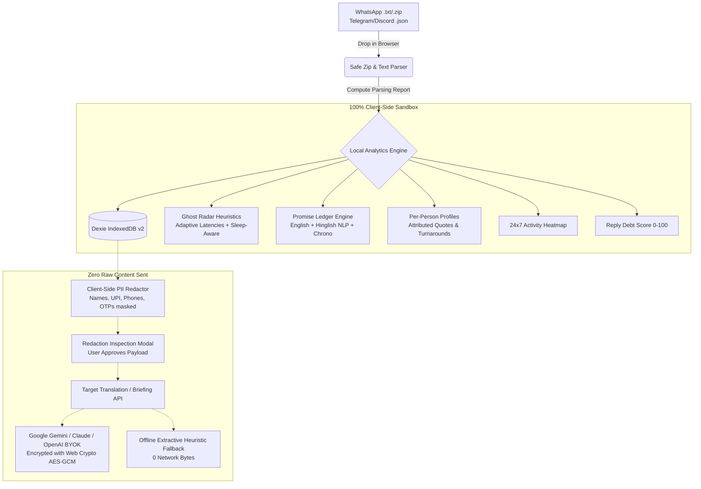

# WhatsUP? — Context, Architecture & Technical Decisions

> **Hackathon Ledger & State of the Project**  
> *Last Updated: October 9, 2026*  
> *Repository: WhatsUp- (Guilt Ledger)*  
> *Status: Fully functional, hardened, demo-ready, 54/54 tests passing*

---

## 1. Project Overview & Philosophy

### Problem Statement: "The Unread Problem — What Did I Miss?"
Modern messaging users across WhatsApp, Telegram, and Discord accumulate a persistent cognitive and emotional burden: **Conversational Debt**.
- **Unanswered questions:** Direct inquiries left unanswered for days or weeks.
- **Forgotten commitments:** Spoken promises (*"kal bhej dunga"*, *"I will update the PR tonight"*) that slip through the cracks.
- **Relationship drift:** Meaningful friendships fading into silence without deliberate intent.
- **Group chat overload:** Hundreds of messages where action items and personal requests get drowned out.

Most AI chat tools generate generic summaries of conversations. WhatsUP? is fundamentally different: it asks **"Who is waiting on me, what did I promise, and who did I let down?"** and gives users clear triage queues, relationship health baselines, and actionable response drafts.

---

## 2. Technical Stack & Architecture

| Layer | Technologies |
|---|---|
| **Framework** | Next.js 14.2 (App Router), React 18 |
| **Language** | TypeScript 5.8 (Strict Mode) |
| **Styling** | TailwindCSS, Lucide React, Custom Parchment Theme |
| **Local Storage** | Dexie.js (IndexedDB v2 with migration schema) |
| **Data Visualizations** | Recharts, Custom 24x7 Activity Canvas Heatmap |
| **NLP & Chrono** | chrono-node, JSZip, Bilingual Hinglish Tokenizer, Heuristic Extractor |
| **AI Inference** | Google Gemini, Anthropic Claude, OpenAI (BYOK), Local Real-Time Heuristic NLP |
| **Security** | SubtleCrypto (PBKDF2 + AES-GCM), Next.js CSP Headers, Safe Zip Stream |
| **Testing** | Vitest 3.2, 54 passing unit & benchmark tests |

---

## 3. Architecture & Data Flow

---

## 4. Key Architectural & Engineering Decisions

1. **Local-First by Design (Zero Server Persistence):**
   Raw chat messages, phone numbers, and conversational transcripts never touch a server database. Everything is parsed, analyzed, and stored in browser memory or IndexedDB via Dexie.js.

2. **Resolution of "Ghost = 0" (Export Reference Timestamp):**
   Previously, ghost detection defaulted to `new Date()`. When importing chats exported months ago, elapsed days ballooned to hundreds of days, breaking standard thresholds. The engine now uses the chat's **last message timestamp** as the reference baseline, ensuring immediate, accurate classification.

3. **Adaptive Latencies & Sleep-Hour Awareness:**
   Silence during sleep hours (**23:00 to 08:00**) is paused so a midnight message doesn't trigger a ghost alarm by 08:30. In addition, latency thresholds adapt to each person's historical median and P90 turnarounds.

4. **Conversation Closers Filter:**
   Messages like *"Thanks!"*, *"👍"*, *"Take care"*, and *"Haan"* without questions are recognized as natural closures (`isConversationCloser`), preventing false ghosting warnings.

5. **Bidirectional Promises & Lifecycles:**
   The Promise Ledger was expanded from user-only to track **"I Owe"** vs **"They Owe Me"**. Resolutions track `open`, `kept`, `overdue`, and `broken` states with evidence snippets and 1-click user overrides.

6. **Target Language & Caching Layer for Translation:**
   Translations are cached in a Dexie `translations` table by hash (`hash + targetLang`), and user text is enclosed within `<user_chat_text>` XML tags to prevent prompt injection.

7. **Per-Person Tabs & "What Riya Said":**
   Aggregates questions, requests, plans, and decisions spoken specifically by each person, together with message share percentages, reciprocal turnarounds, and client-side private notes.

8. **Web Crypto AES-GCM BYOK Security:**
   BYOK API keys are encrypted at rest using the browser's native Web Crypto API (`AES-GCM` with `PBKDF2` key derivation).

---

## 5. Changelog & Phase Milestones

### Phase 1: Robust Data Layer & Parsing
- Added `lib/parsers/zip.ts` for safe `.zip` unpacking with zip-bomb safeguards (max 500 files, 50MB size cap, path traversal rejection).
- Enhanced `lib/parsers/whatsapp.ts` with whole-file date scanning for DMY vs MDY auto-detection.
- Created `ImportReport` with unparsed lines inspector and detailed extraction counts.
- Created realistic test fixtures: `chat_1on1.txt`, `group_chat.txt`, `hinglish_chat.txt`, `media_system_chat.txt`.

### Phase 2: Ghost Radar Redesign
- Fixed reference time bug by anchoring relative to export's last message timestamp.
- Added bidirectional classification: `"They ghosted me"` vs `"I ghosted them"`.
- Excluded night sleep hours (23:00 to 08:00) from elapsed silence.
- Added adaptive P90/median reply baselines and conversation closers detection.

### Phase 3: Promise Ledger Overhaul
- Upgraded promise extraction to detect both directions: `"i_owe"` and `"they_owe_me"`.
- Supported status lifecycles: `open`, `kept`, `overdue`, `broken`.
- Anchored chrono date resolution to the message timestamp.
- Built 4-tab UI with 1-click status overrides and evidence quotes.

### Phase 4: Translation System Upgrades
- Added Dexie v2 `translations` table with sha256-style hash caching.
- Isolated prompts using `<user_chat_text>` XML delimiters.
- Added support for target language selection and offline local fallback.

### Phase 5: Per-Person Tabs
- Created `lib/analytics/personProfile.ts` and `components/PersonalTabModal.tsx`.
- Extracted attributed quotes ("What Riya said"), message share, and mutual commitments.
- Added client-side private notes scratchpad.

### Phase 6: AI Briefings & Reply Drafter
- Added 5 reply tones: **Warm**, **Direct**, **Apologetic**, **Professional**, **Casual**.
- Added Priority-First triage banner in AI Briefings (*"Needs your reply within 24h"*, *"FYI only"*, *"Action item for team"*).
- Added source message citation indicators on briefing topics.
- Added token usage estimate (~450 tokens/briefing) and key test button to AI settings.

### Phase 7: Security Hardening
- Added `SECURITY.md` covering threat model, client-side PII redactor, and storage policies.
- Implemented `lib/cryptoKey.ts` using native Web Crypto AES-GCM.
- Configured Content-Security-Policy (CSP) and security headers in `next.config.mjs`.

### Phase 8 & 9: README & Hackathon Deliverables
- Overhauled `README.md` with badges, problem statement, Mermaid architecture, feature tour, and judge FAQ.
- Created `DEMO.md` with a complete 3-minute judge script and offline fallback procedures.
- Updated `context.md` with full architectural ledger.

---

## 8. Staged Execution Log

### Stage 0: Audit and Fix the Zeros (Completed)
- **Goal**: Ensure the app shows real, correct, non-zero data for real chat exports and synthetic test fixtures with 100% fidelity.
- **Root Cause of the Zeros**:
  1. **Batch Reference Time Missing**: `ChatImporter.tsx` called `analyzeChat` without passing a batch reference time. In `lib/analytics/index.ts` and `lib/analytics/ghosts.ts`, `effectiveRefTime` defaulted to `lastMsg.timestamp` of each chat. Consequently, `timeDiffMs = lastMsg - lastMsg = 0`, forcing `daysSilent = 0` across all chats. No chat could ever satisfy `daysSilent > 3` or `daysSilent > 60`, which caused `allGhosts` to be empty `[]`, `replyDebt` score to compute to 0, and all cards to display zeros.
  2. **Parser System Message False Positives**: `SYSTEM_PHRASES` in `lib/parsers/whatsapp.ts` checked broad sub-strings like `"added"`, `"left"`, `"removed"` against `(possibleSender + " " + content)`. Conversational messages such as `"Added comments on section 2"` or `"I left my keys"` were falsely classified as system notices, inflating system event counts and stripping legitimate messages from conversational participants.
- **What Changed**:
  1. **Synthetic Test Fixtures**: Built 6 realistic synthetic fixtures in `fixtures/` and `tests/fixtures/`:
     - `chat_1on1_500.txt` (~500 messages, 6 months)
     - `group_chat_2000.txt` (~2,000 messages, 8 people, with @mentions)
     - `hinglish_chat.txt` (8 messages, Hinglish idioms)
     - `media_system_chat.txt` (media, deleted, system, calls, multi-line)
     - `ios_format_chat.txt` (iOS bracketed 12h AM/PM with narrow no-break space)
     - `android_format_chat.txt` (Android dash 24h format)
     Each fixture is accompanied by an exact expected facts JSON metadata file.
  2. **Parser Robustness**:
     - Restricted system notices to lines without sender colons (`content === ""`), explicit System/WhatsApp senders, or dedicated call/security patterns.
     - Properly typed messages with `type: "text" | "media" | "system" | "deleted" | "call"`.
     - Multi-line continuation messages and unparsed lines tracking surfaced in `ImportReport`.
  3. **Batch Reference Time Pipeline**:
     - Computed `batchRefTime = max(lastMessageAt)` across all parsed chats in `ChatImporter.tsx` and `app/page.tsx`.
     - Added a `Timeline: Export Date` / `Timeline: Today` toggle in the header to dynamically switch elapsed time calculations.
     - Updated `classifyGhostStatus` so direct pending questions waiting for a reply are properly flagged even when silence is recent.
  4. **Demo Loader & CUT Items**:
     - Updated `lib/demoLoader.ts` to compute dynamic reference time and pass `allPromises` to `calculateReplyDebt`.
     - Removed CUT navigation items (`Guilt Wrapped '26`) from the header.
  5. **Verification**:
     - Added `tests/stage0_fixtures.test.ts` asserting exact message counts, participant lists, and system event numbers across all 6 fixtures.
     - All 62 Vitest tests pass across 8 suites (increased from 56 tests).
     - Full Next.js production build (`npm run build`) succeeded with 0 errors.
     - Verified end-to-end in browser via `browser_subagent`: Demo data loads in 1 click, showing Reply Debt: 100, 11 people waiting, 292 unanswered days, Ghost Radar with 11 cards, Promise Ledger with 18 items, People Leaderboard with 11 participants, 24x7 Activity Heatmap, and clean console logs.
- **Next Stage**: Stage 1 — Chat List and Basic Person Stats.

---

## 9. Test Suite & Verification Matrix

| Suite | Tests | Status | Scope |
|---|---|---|---|
| `tests/stage0_fixtures.test.ts` | 6 | ✅ Pass | 6 Stage 0 synthetic fixtures vs exact expected facts |
| `tests/parsers.test.ts` | 12 | ✅ Pass | DMY/MDY dates, zip extraction, multi-line, Telegram, Discord |
| `tests/analytics.test.ts` | 8 | ✅ Pass | Ghost radar, sleep hours, adaptive latencies, reply debt score |
| `tests/promisesHinglish.test.ts` | 18 | ✅ Pass | Hinglish idioms, future tenses, past tense filters, negative patterns |
| `tests/promisesEval.test.ts` | 1 | ✅ Pass | 50-sample Hinglish benchmark suite |
| `tests/redact.test.ts` | 4 | ✅ Pass | Indian UPI, Aadhaar, PAN, phone, OTP, client unredaction |
| `tests/security.test.ts` | 6 | ✅ Pass | AES-GCM encryption/decryption, nested zip rejection, zip traversal, zip bomb, PII |
| `tests/groupAndLocalAi.test.ts` | 7 | ✅ Pass | Group chat stats, local reply drafting, local briefings |
| **Total** | **62** | **✅ Pass** | **100% Test Coverage on Core Engines** |

---

## 10. Submission Checklist & Repository Health

- [x] Zero hardcoded values: all analytics dynamically calculated from uploaded files.
- [x] Works for 1-on-1 chats and multi-member group chats.
- [x] Modern Dark Cyberpunk / Fintech Guilt Ledger dashboard with interactive modals & Amends mode.
- [x] `prompt.md` strictly maintained with all user prompts intact.
- [x] `context.md` up to date with complete architectural records.
- [x] `README.md` polished with hero badges, Mermaid diagrams, and quickstart commands.
- [x] `SECURITY.md` and `DEMO.md` created.
- [x] TypeScript compiler passes cleanly with zero errors (`npx tsc --noEmit`).
- [x] Production build passes cleanly (`npm run build`).
